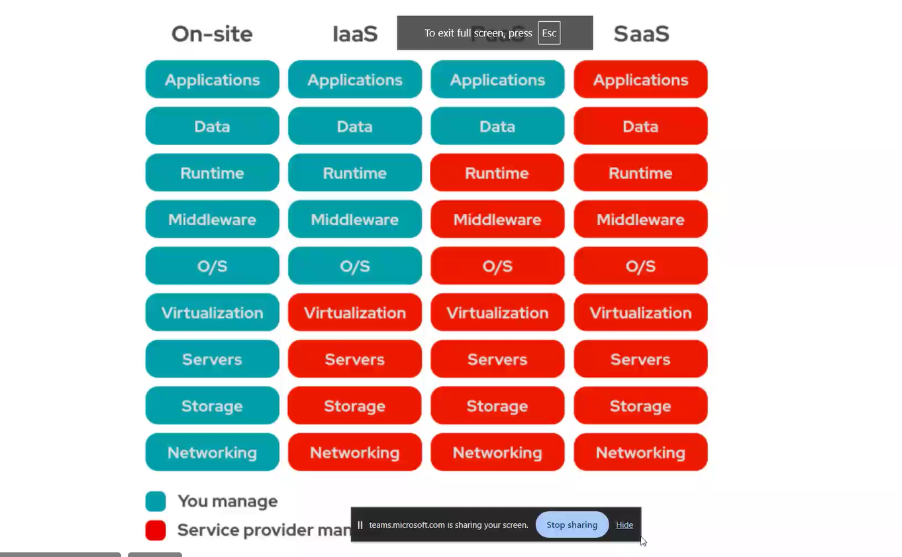
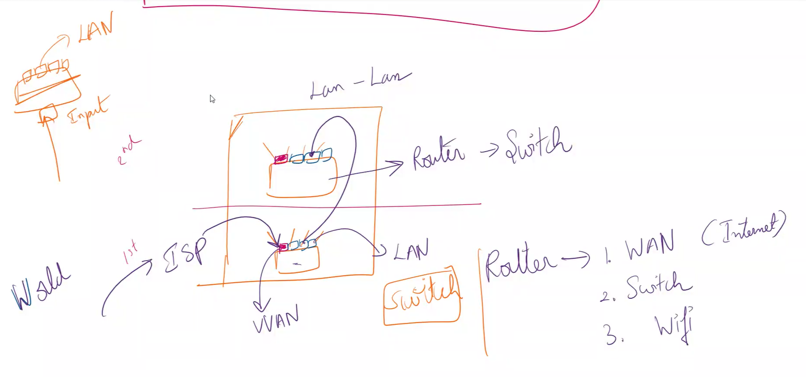
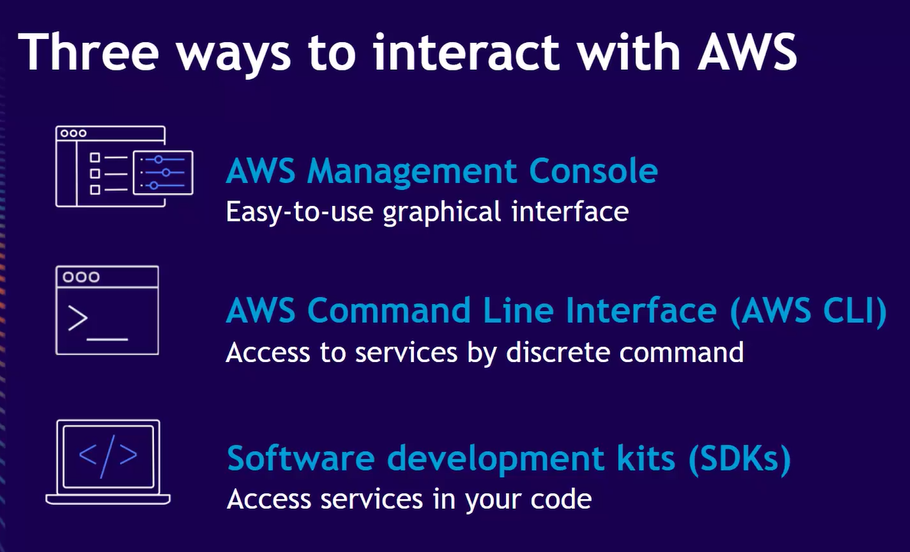

- alpine is strip down version of ubantu
- complete os is ubantu

## how to avoid ddos attacks ?

- filter by ip address
- giving captcha
- redirects to other track
- safety plan should be maintained

### main service of aws is renting computers

- ip level configuration it can do

# cloud:

IAAS:(EG: u are bulding ur own home)

- it is just a system which they are giving for rents. wer we can install and do anything. (any software.)
- aws,azure,google cloud provider they just give pc's.
- instal database,browsers.

SAAS:(using furnished home)

- no mainatining of db  
  if anything is not working, then it is not ur problem
  eg"twitter,zomato,google drive etc

PAAS:(renting a home but not furnished)

- softwares are preinstalled by paas
- for building applications
- they will install(os, postgre) all the things already. only code we need to put it.  
  they will manage the infra,enivornment for you.

with AWS-- we have to do all the things like installing etc.

eg:netlify will do this  
render.com  
railway app (its costly)
heroku
vercel  
 it is use ful for free lancers, start-ups

- dynamo db and rds are the databases used in aws
- simple storage service (s3) is like google drive store the things
- logs are stored in aws and used to build database
- aws are maintained by devops

# advantages of aws computing

- trade upfront expense for variable expense
- benefit from massive economics of scale
- stop guessing capacity
- speed
  

## cdn content delivery network - keep a copy accross the work which is responding faser takes that and cutoff other

- colud flare saves from ddoc attacks also provides cdn
- copy of all will be in data centers
- bombay have the datacenters in india

# key servies

- compute
- storage
- databases
- networking
- security
- nettworking is done by amazon route53--> acts as firewall
- configuration is done
- security guard sees the right req or not

- ec2 - elastic cloud compute
  app is present in ec2
  more rigid
  and this ec2 is used to increase the ram and storage
  amazon ebs is costly but faster
  

# amazon s3 cheaper but slower, store bulk data

# ec2 ---> os,soure code

# databse stores the collection of data logins and all data

# instagram uses what

When a user uploads a photo or video on Instagram, the application (running on EC2 instances) typically receives this data.

- When Instagram uses Amazon EC2 instances, they might attach EBS volumes to these instances to store application data that requires fast access and persistence.
- For example, databases (like MySQL, PostgreSQL, or NoSQL databases) that store user data, preferences, and other structured information might use EBS volumes for their storage needs.
- EBS volumes are also used for storing application logs, configurations, and other operational data that needs to persist beyond the lifespan of an EC2 instance.

- c and d drives example
- os is stored in ebs
- enviromental details + codes in ec2

#

> router acts as

- wifi
- gateway
- switch

- extending the network is switch
- router gives wifi while switch is extension
- colured port in router is wan

# difference between switch and router

# aws core and infrastructure and services

security groups --->

NAS - hardwaree components

# three ways to interact with aws

- sdk is support for other languages
- cli is used for login to computers
  22 ssh port numbr
  port nmbr for http 80- 80 other people can eaisly access them
  apt is packet manager in ubantu

# difference between authentication and authorization

> <b>Authentication -

- verifies user identity ,
- ex- username passoword logins

> <b>Authorization -

- grants or denies permission to something
- permission granted by orgnasaiation

# Authentication flow

fetch movie --> delete

# IAM

- Identity and Access Management
  With AWS Identity and Access Management (IAM), you can specify who or what can access services and resources in AWS, centrally manage fine-grained permissions, and analyze access to refine permissions across AWS.

# offers by IAM

- fine gained access control--- only limited people access
- SAML 2.0/LDAP integrations --> single sign on --- google sign one time acces everywhere
- MFA - multi factor authentication
- Manegers users and they access
- Manage Roles and permissions

# the issue with passwords and credentials

- entropy
- rainbow table attack
- password repetition
- password rotation
- avoid pswd and credentials
- make it all temporary

# IAM elements

AWS identity & access management

1.  IAM USERS
2.  IAM GROUPS
3.  IAM ROLES - they work on trust bases ,haves the cap symbol

a. trust
who can assume this role

- defined by the role trust policy

b. permissions
what you can do after assuming a role

- defined by Iam polices

4.  IAM POLICES
    way to enforce this action
    2 users dev grp acces for ec2 instance
