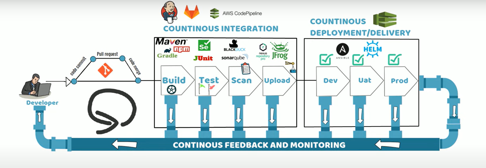

# Devops

- Deliver applications and services at high velocity
- evolving and improving products at a faster pace than organizations using traditional software development and infrastructure management processes.
  -This speed enables organizations to better serve their customers and compete more effectively in the market.

- with Continuous Integration, Continuous Delivery, Infrastructure as Code,
  and Monitoring and Logging.

## Continuous Integration:

is a software development practice where developers
regularly merge their code changes into a central repository, after which
automated builds and tests are run.

## Continuous Integration:

is a software development practice where developers
regularly merge their code changes into a central repository, after which
automated builds and tests are run.

## Continuous Delivery:

is a software development practice where code changes
are automatically built, tested, and prepared for a release to production.

## Infrastructure as Code:

is a practice in which infrastructure is provisioned and
managed using code and software development techniques, such as version
control, and continuous integration.

## Monitoring and Logging:

enables organizations to see how application and
infrastructure performance impacts the experience of their product’s end user.

## Communication and Collaboration:

practices are established to bring the
teams closer and by building workflows and distributing the responsibilities for
DevOps.

## Security:

should be a cross cutting concern. Your continuous integration and
continuous delivery (CI/CD) pipelines and related services should be
safeguarded and proper access control permissions should be setup.

#

# git branching category

- open source project hosted on github --> kubernetes
- 3300 contributers
- when we want to add new changes instead of making changes on main branch
- work on diff branch and merge to old version and delete old version ex- uber
- release application - build appln from release branch , if all features are satisfied then release to customers through release branch

# what is devops

- a practice adopting in an organisation
- a culture that improves the org ability to deliver the applications
- improving delivery -->automation-->quality --->Monitoring--->Testing

# why devops

before devops
sys admin ---> server
builder release engineer --->deploy code
server admin ---> app server

# SDLC

- The software development lifecycle (SDLC) is the cost-effective and time-efficient process that development teams use to design and build high-quality software.
- The goal of SDLC is to minimize project risks through forward planning so that software meets customer expectations during production and beyond.

### benefits of sdlc

1. Increased visibility of the development process for all stakeholders involved
2. Efficient estimation, planning, and scheduling
3. Improved risk management and cost estimation
4. Systematic software delivery and better customer satisfaction

#

plan
design
implement
test
deploy
maintain

#

CI/CD Pipelines

- steps must be performed in order to deliver new version to customer
- improves the software delivery throughout sdlc via automation
- improves higher code quality, security,faster

# building automation :

Build Automation is the process of scripting and automating the retrieval of software code from a repository,
compiling it into a binary artifact,
executing automated functional tests,
and publishing it into a shared and centralized repository.

- continuous integration : build-->test-->merge
- continuous delivery---> automatically release to the customer
- continuous deployment ---> automatically deploy to production

# Monolithic applications

- those are hard to deploy and update because
- those are developed and deployed as a unit so when changes are made the entire application must be redeployed
- Are implemented using a single development stack, so changing technology is difficult and costly

# why devops

- agility
- rapid delivery
- reliability
- scale
- improved collaboration
- security

# CI

- The key goals of continuous integration are to
- find and address bugs quicker,
- improve software quality,
- and reduce the time it takes to validate and
- release new software updates.

# CD

- Continuous deployment is similar to continuous delivery, but with automatic deployment to production.
- Tested code does not need an explicit approval before being pushed to production.

# Microservice architecture

- According to research from DevOps Research and Assessment (DORA), the type of architecture the team settles on, is a direct predictor of how successful they will be with achieving continuous delivery.
- The nature of microservices supports faster development, updates and corrections, and quicker deployments.

#

- A DevOps pipeline is a set of stages that move code from source, all the way to deployment.
- The graphic that follows depicts typical stages in a DevOps pipeline and depicts the phases involved in a CI/CD pipeline.

#

- DevOps teams iteratively remove process overlaps, human errors, and bottlenecks through automation.

# devops cycle

## code

- develop code in lang like.net,java or python when ready deliver code to central location .

## Build

- compile code
- check code styles and standards
- analyze code complexity and maintainability
- validate dependencies
- create container images
- run unit tests

## Test

- functional
- integration
- regression
- acceptance
- load
- security

## release

- prepare and package the tested code with a specfic version nmbr

## deploy

- deploy the release to targeted environments such as tests,staging ,alpha,beta,or production

## Monitor

monitor for errors and unusual activities

# tools

# development

IDEs: AWS Cloud9, IntelliJ, Eclipse, Visual Studio Code
SDKs: AWS SDK for Java, iPhone SDK
Source code repositories: GitHub, AWS CodeCommit

# CI,CD

Build tools: Jenkins, Travis CI, AWS CodeBuild
Source control tools, repositories: Git, AWS CodeCommit
Deployment tools: AWS CodeDeploy, AWS CloudFormation
Pipeline automation tools: AWS CodePipeline, Jenkins, GitLab

# infrastructure automation

Infrastructure automation tools: AWS CloudFormation, Terraform, AWS Elastic Beanstalk
Configuration management tools: Chef, Puppet, AWS OpsWorks

# containers and server less

Examples:

Serverless services: AWS Lambda, AWS Fargate
Container services:
Runtimes: Docker, Containerd
Orchestration: Amazon Elastic Container Service (Amazon ECS), Kubernetes, Amazon Elastic Kubernetes Service (Amazon EKS)

# monitoring and observability

Examples: AWS X-Ray, Amazon CloudWatch, AWS Config, AWS CloudTrail
