**Database Tables:**

1. **Customers:**

   - `CustomerID` (Primary Key)
   - `FirstName`
   - `LastName`
   - `Email`
   - `Phone`
   - `Address`

CREATE TABLE Customers (
CustomerID INT PRIMARY KEY,
FirstName VARCHAR(50),
LastName VARCHAR(50),
Email VARCHAR(100),
Phone VARCHAR(20),
Address VARCHAR(255)
);

INSERT INTO Customers (CustomerID, FirstName, LastName, Email, Phone, Address)
VALUES
(1, 'Rishi', 'sairi', 'rishi.sairi@gmail.com', '123-456-7890', '123 Main St'),
(2, 'Nithin', 'siddarth', 'nithin.polo@gmail.com', '987-654-3210', '456 Elm St');

2. **Products:**

   - `ProductID` (Primary Key)
   - `ProductName`
   - `Description`
   - `Price`

CREATE TABLE Products (
ProductID INT PRIMARY KEY,
ProductName VARCHAR(100),
Description TEXT,
Price DECIMAL(10, 2)
);

INSERT INTO Products (ProductID, ProductName, Description, Price)
VALUES
(1, 'Laptop', 'High-performance laptop', 1200.00),
(2, 'Smartphone', 'Latest smartphone model', 800.00);

3. **Orders:**

   - `OrderID` (Primary Key)
   - `CustomerID` (Foreign Key referencing Customers)
   - `OrderDate`
   - `TotalAmount`

   CREATE TABLE Orders (
   OrderID INT PRIMARY KEY,
   CustomerID INT,
   OrderDate DATE,
   TotalAmount DECIMAL(10, 2),
   FOREIGN KEY (CustomerID) REFERENCES Customers(CustomerID)
   );

INSERT INTO Orders (OrderID, CustomerID, OrderDate, TotalAmount)
VALUES
(1, 1, '2024-06-15', 1200.00),
(2, 2, '2024-06-16', 1600.00);

4. **OrderDetails:**

   - `OrderDetailID` (Primary Key)
   - `OrderID` (Foreign Key referencing Orders)
   - `ProductID` (Foreign Key referencing Products)
   - `Quantity`

   CREATE TABLE OrderDetails (
   OrderDetailID INT PRIMARY KEY,
   OrderID INT,
   ProductID INT,
   Quantity INT,
   FOREIGN KEY (OrderID) REFERENCES Orders(OrderID),
   FOREIGN KEY (ProductID) REFERENCES Products(ProductID)
   );
   INSERT INTO OrderDetails (OrderDetailID, OrderID, ProductID, Quantity)
   VALUES
   (1, 1, 1, 1),
   (2, 2, 1, 2),
   (3, 2, 2, 1);

5. **Inventory:**

   - `InventoryID` (Primary Key)
   - `ProductID` (Foreign Key referencing Products)
   - `QuantityInStock`
   - `LastStockUpdate`

   CREATE TABLE Inventory (
   InventoryID INT PRIMARY KEY,
   ProductID INT,
   QuantityInStock INT,
   LastStockUpdate DATETIME,
   CONSTRAINT FK_ProductID FOREIGN KEY (ProductID) REFERENCES Products(ProductID)
   );

INSERT INTO Inventory (InventoryID, ProductID, QuantityInStock, LastStockUpdate)
VALUES
(1, 1, 50, GETDATE()),  
(2, 2, 30, GETDATE());

**Questions:**

1. Write an SQL query to retrieve the names and emails of all customers.

```sql
select FirstName,LastName,Email from Customers;
```


2. Write an SQL query to list all orders with their order dates and corresponding customer names.

```sql
SELECT Orders.OrderID, Orders.OrderDate, CONCAT(Customers.FirstName, ' ', Customers.LastName) AS CustomerName
FROM Orders
INNER JOIN Customers ON Orders.CustomerID = Customers.CustomerID;
```


3. Write an SQL query to insert a new customer record into the "Customers" table. Include customer information such as name, email, and address.

```sql
INSERT INTO Customers ( CustomerID,FirstName, LastName, Email, Phone, Address)
VALUES (3,'Nithya', 'sairi', 'nithya.sairi@gmail.com', '555-123-4567', '789 Oak St');
```

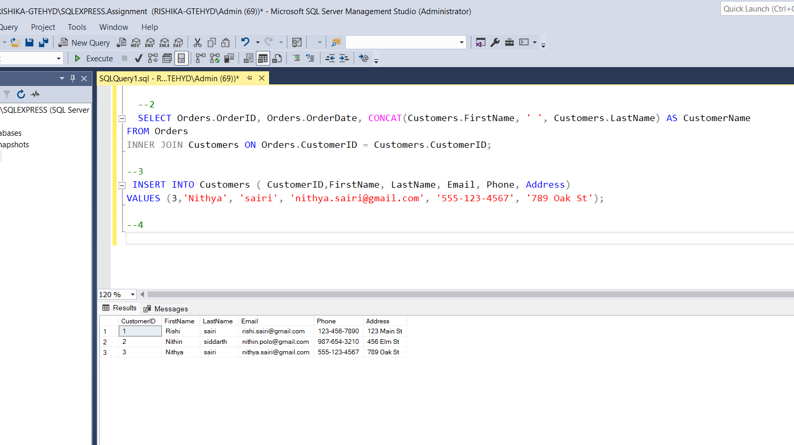

4. Write an SQL query to update the prices of all electronic gadgets in the "Products" table by increasing them by 10%.

```sql
update products
set Price = Price \* 1.1
where ProductName IN ('Laptop', 'Smartphone');
```

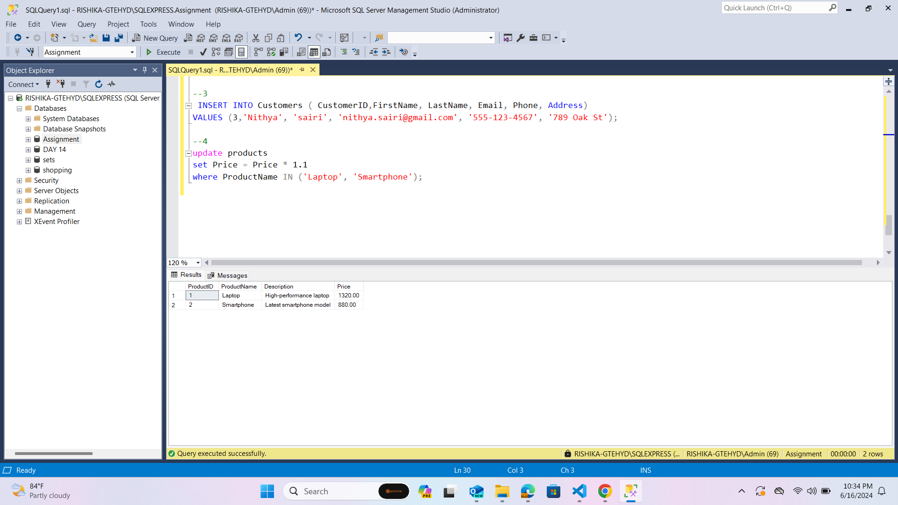

5. Write an SQL query to delete a specific order and its associated order details from the "Orders" and "OrderDetails" tables. Allow users to input the order ID as a parameter.

```sql
DECLARE @del int
set @del = 1

DELETE FROM OrderDetails
WHERE OrderID = @del;
DELETE FROM Orders
WHERE OrderID = 1;

```

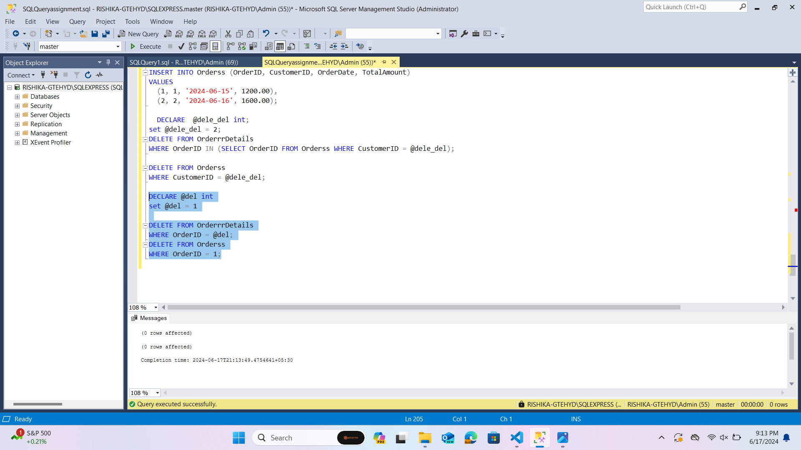

6. Write an SQL query to insert a new order into the "Orders" table. Include the customer ID, order date, and any other necessary information.

```sql

INSERT INTO Ordersss (OrderID,CustomerID, OrderDate, TotalAmount)
VALUES
  (5,12345, '2024-06-17', 150.00);

```

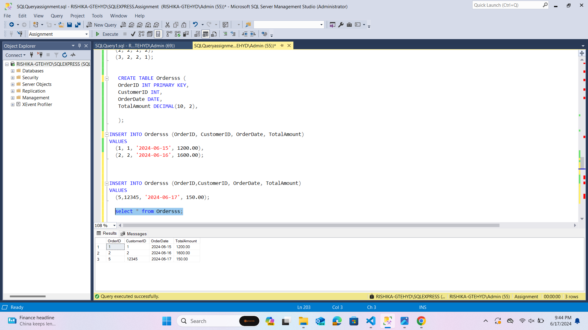

7. Write an SQL query to update the contact information (e.g., email and address) of a specific customer in the "Customers" table. Allow users to input the customer ID and new contact information.

```sql
use [Assignment ];
DECLARE @cus_id int;
DECLARE @new_email VARCHAR(255);
DECLARE @new_Address VARCHAR(255);
SET @cus_id=3;
SET @new_email='new.email@gmail.com';
SET  @new_Address='mancherial';
update Customers
SET Address=@new_Address,
Email=@new_email
where CustomerID =@cus_id

select * from Customers;

```


8. Write an SQL query to recalculate and update the total cost of each order in the "Orders" table based on the prices and quantities in the "OrderDetails" table.

```sql
UPDATE Orders
SET TotalAmount = (
    SELECT SUM(OD.Quantity * P.Price)
    FROM OrderDetails OD
    JOIN Products P ON OD.ProductID = P.ProductID
    WHERE OD.OrderID = Orders.OrderID
)
WHERE OrderID IN (SELECT OrderID FROM OrderDetails);

```

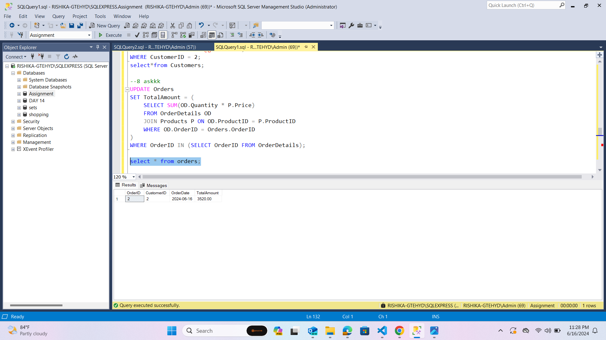

9. Write an SQL query to delete all orders and their associated order details for a specific customer from the "Orders" and "OrderDetails" tables. Allow users to input the customer ID as a parameter.

```sql
DECLARE  @dele_del int;
set @dele_del = 2;
DELETE FROM OrderrrDetails
WHERE OrderID IN (SELECT OrderID FROM Orderss WHERE CustomerID = @dele_del);

DELETE FROM Orderss
WHERE CustomerID = @dele_del;
```

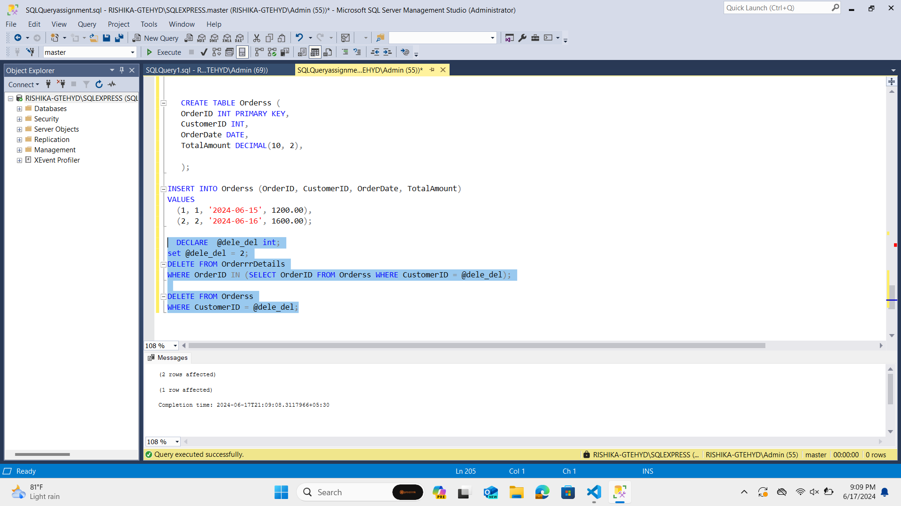

10. Write an SQL query to insert a new electronic gadget product into the "Products" table, including product name, category, price, and any other relevant details.

```sql
INSERT INTO Products (ProductID,ProductName, Description, Price)
VALUES (3,'Tablet', '10-inch tablet with high-res display', 500.00);
```

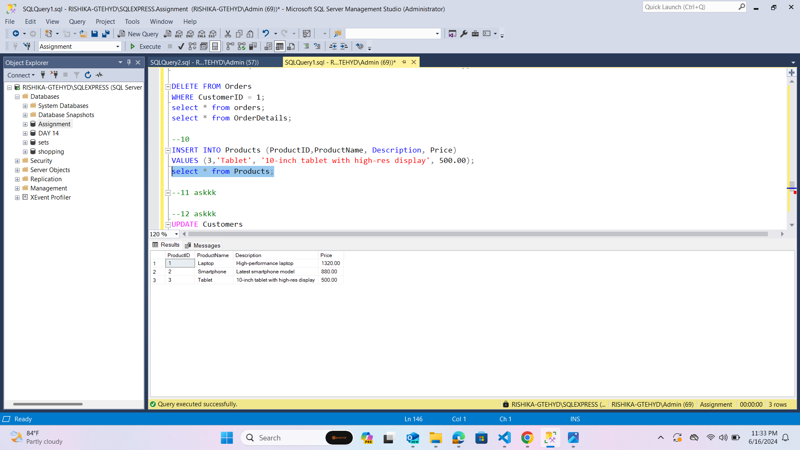

11. Write an SQL query to update the status of a specific order in the "Orders" table (e.g., from "Pending" to "Shipped"). Allow users to input the order ID and the new status.

```sql

DECLARE @order_id_update int;
set @order_id_update = 1001;
UPDATE orders
SET Status = 'shipped'
where orderID=@order_id_update;

```

12. Write an SQL query to calculate and update the number of orders placed by each customer in the "Customers" table based on the data in the "Orders" table.

```sql
UPDATE Customersss
SET NumberOfOrders = (
    SELECT COUNT(*)
    FROM Orderrrs
    WHERE Orderrrs.CustomerID = Customersss.CustomerID
);
 select * from  Customersss;

```

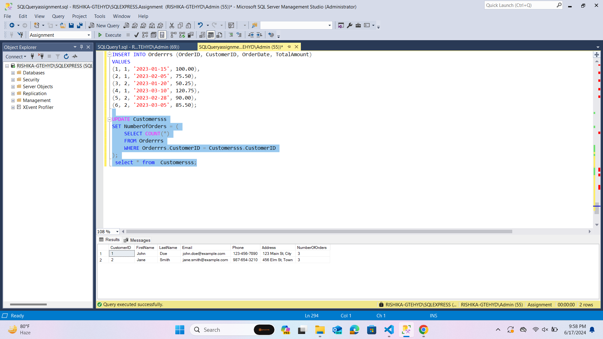

13. Write an SQL query to retrieve a list of all orders along with customer information (e.g., customer name) for each order.

```sql
SELECT Orders.OrderID, Orders.OrderDate, CONCAT(Customers.FirstName, ' ', Customers.LastName) AS CustomerName
FROM Orders
JOIN Customers ON Orders.CustomerID = Customers.CustomerID;
```

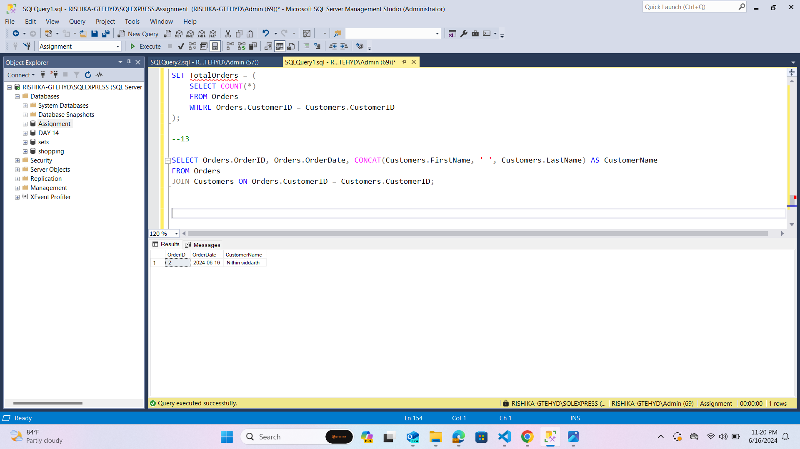

14. Write an SQL query to find the total revenue generated by each electronic gadget product. Include the product name and the total revenue.

```sql
SELECT Products.ProductName, SUM(OrderDetails.Quantity * Products.Price) AS TotalRevenue
FROM OrderDetails
JOIN Products ON OrderDetails.ProductID = Products.ProductID
GROUP BY Products.ProductName;

```

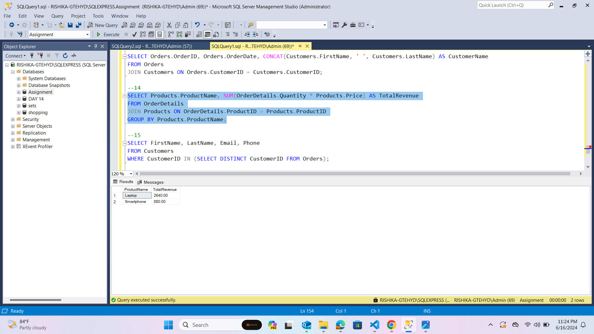

15. Write an SQL query to list all customers who have made at least one purchase. Include their names and contact information.

```sql
SELECT FirstName, LastName, Email, Phone
FROM Customers
WHERE CustomerID IN (SELECT DISTINCT CustomerID FROM Orders);
```

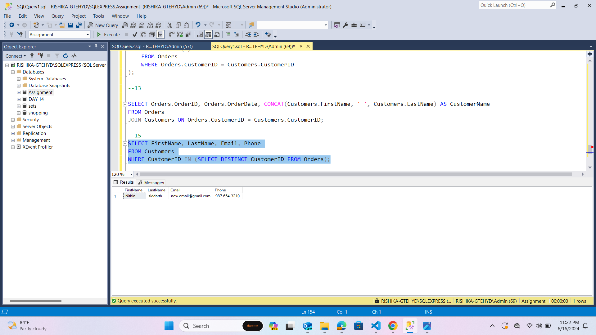
