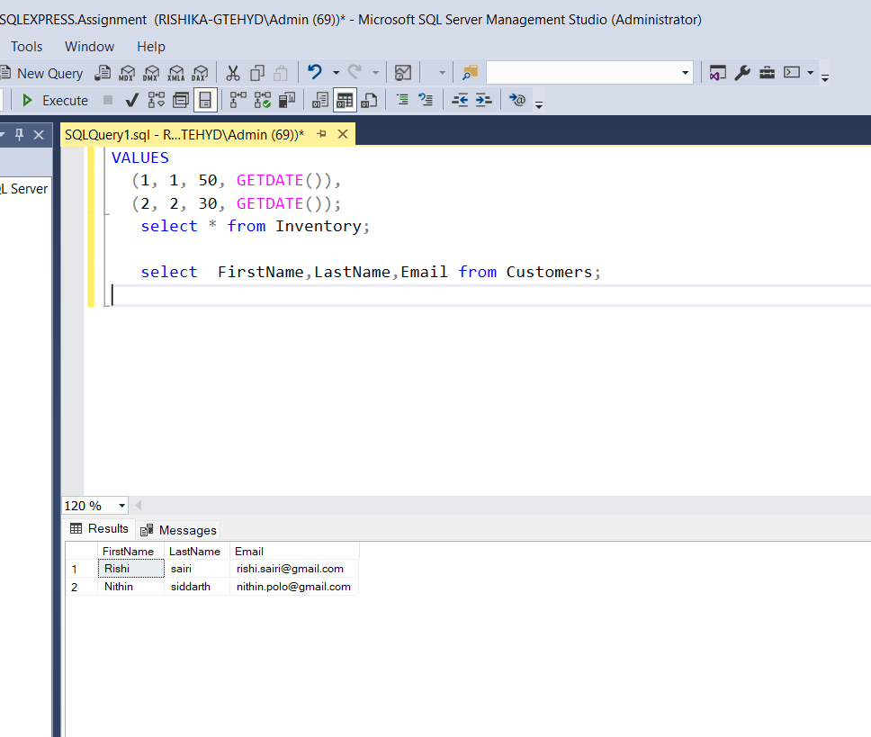
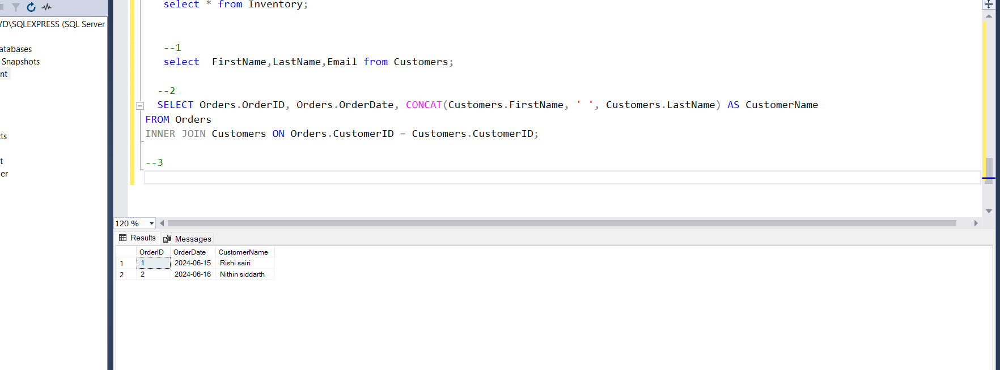

**Database Tables:**

1. **Customers:**

   - `CustomerID` (Primary Key)
   - `FirstName`
   - `LastName`
   - `Email`
   - `Phone`
   - `Address`

CREATE TABLE Customers (
CustomerID INT PRIMARY KEY,
FirstName VARCHAR(50),
LastName VARCHAR(50),
Email VARCHAR(100),
Phone VARCHAR(20),
Address VARCHAR(255)
);

INSERT INTO Customers (CustomerID, FirstName, LastName, Email, Phone, Address)
VALUES
(1, 'Rishi', 'sairi', 'rishi.sairi@gmail.com', '123-456-7890', '123 Main St'),
(2, 'Nithin', 'siddarth', 'nithin.polo@gmail.com', '987-654-3210', '456 Elm St');

2. **Products:**

   - `ProductID` (Primary Key)
   - `ProductName`
   - `Description`
   - `Price`

CREATE TABLE Products (
ProductID INT PRIMARY KEY,
ProductName VARCHAR(100),
Description TEXT,
Price DECIMAL(10, 2)
);

INSERT INTO Products (ProductID, ProductName, Description, Price)
VALUES
(1, 'Laptop', 'High-performance laptop', 1200.00),
(2, 'Smartphone', 'Latest smartphone model', 800.00);

3. **Orders:**

   - `OrderID` (Primary Key)
   - `CustomerID` (Foreign Key referencing Customers)
   - `OrderDate`
   - `TotalAmount`

   CREATE TABLE Orders (
   OrderID INT PRIMARY KEY,
   CustomerID INT,
   OrderDate DATE,
   TotalAmount DECIMAL(10, 2),
   FOREIGN KEY (CustomerID) REFERENCES Customers(CustomerID)
   );

INSERT INTO Orders (OrderID, CustomerID, OrderDate, TotalAmount)
VALUES
(1, 1, '2024-06-15', 1200.00),
(2, 2, '2024-06-16', 1600.00);

4. **OrderDetails:**

   - `OrderDetailID` (Primary Key)
   - `OrderID` (Foreign Key referencing Orders)
   - `ProductID` (Foreign Key referencing Products)
   - `Quantity`

   CREATE TABLE OrderDetails (
   OrderDetailID INT PRIMARY KEY,
   OrderID INT,
   ProductID INT,
   Quantity INT,
   FOREIGN KEY (OrderID) REFERENCES Orders(OrderID),
   FOREIGN KEY (ProductID) REFERENCES Products(ProductID)
   );
   INSERT INTO OrderDetails (OrderDetailID, OrderID, ProductID, Quantity)
   VALUES
   (1, 1, 1, 1),
   (2, 2, 1, 2),
   (3, 2, 2, 1);

5. **Inventory:**

   - `InventoryID` (Primary Key)
   - `ProductID` (Foreign Key referencing Products)
   - `QuantityInStock`
   - `LastStockUpdate`

   CREATE TABLE Inventory (
   InventoryID INT PRIMARY KEY,
   ProductID INT,
   QuantityInStock INT,
   LastStockUpdate DATETIME,
   CONSTRAINT FK_ProductID FOREIGN KEY (ProductID) REFERENCES Products(ProductID)
   );

INSERT INTO Inventory (InventoryID, ProductID, QuantityInStock, LastStockUpdate)
VALUES
(1, 1, 50, GETDATE()),  
(2, 2, 30, GETDATE());

**Questions:**

1. Write an SQL query to retrieve the names and emails of all customers.

```sql
select FirstName,LastName,Email from Customers;
```



2. Write an SQL query to list all orders with their order dates and corresponding customer names.

```sql
SELECT Orders.OrderID, Orders.OrderDate, CONCAT(Customers.FirstName, ' ', Customers.LastName) AS CustomerName
FROM Orders
INNER JOIN Customers ON Orders.CustomerID = Customers.CustomerID;
```


